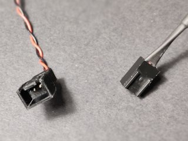

# 3 or 4 pin fan header socket
*3D printable connector for 3- or 4-pin computer fan plugs*

### License
[Creative Commons - Attribution](https://creativecommons.org/licenses/by/4.0/)

### Gallery

[🔎](images/photo1.jpg) [🔎](images/photo2.jpg) [🔎](images/photo3.jpg)

## Description and Instructions

This is a male socket for a 3- or 4-pin fan connector, modeled after the connector that usually comes with Noctua fans. I designed this because for some reason one of those fans was shipped with a 4-pin connector that didn't quite fit the plug, and I broke off the tab while trying to make it fit anyhow.
These connectors, when printed accurately, will accept the pins from the original connectors. You can remove them either by demolishing the original connectors, or shoving a needle in the right place to unhook them. You may need to bend the hook a bit afterwards to ensure it will catch in the new connector housing.

### Printing

I printed this at 0.15 mm layers in PETG. Other materials will probably work well too, but the model was tweaked to work best in PETG.

It is crucial for this to be printed accurately to ensure the pins will fit. This was designed specifically for the kind of pins as used in the Noctua connectors, so you may need to adjust the model for other brands of connectors.
